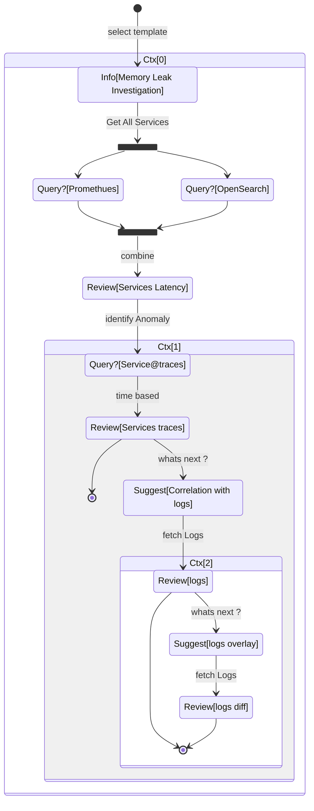

## Conversation Template Sample

Memory Leak Investigation Conversation Demo

## Conversation Initiation Context
The User is presented with a notification for memory issues

Once the user opens the AI assistant he is promoted with the next text:

---
### Conversation:
**AI**:

Hello, I'm an Observability assistant driven by AI. I would like to help you answer any questions you may have or assist you solving any issues in your system.
What would you like to do next: 
 1 - Answer questions about my system ?
 2 - Assist with solving issues in my system ?

**USER**:

Option 2 Please... 

**AI**:

Sure - happy to help, in order to assist with solving an issue in the system, the first step would be to diagnose a problem and verify if the problem exists.
Can you please describe what you would like to examine ?

**USER**:

I have a notification of a possible memory issue on one of my services, can you help ?

**AI**:

Certainly, would you like me to find a standard operating procedure that may match the issue you mentioned? 

**USER**:

Yes that would work...

**AI**:

The Memory Leak Investigation SOP seems the most relevant to the issue you've describes.
The next diagram show it consists of the following steps:


**USER**:

Ok can you help ?

**AI**:

Yes, I would be happy to assist, would you like to see your current services ?

**USER**:

Yes

**AI**:

These are your services list according to the services logs ingested in the past week:
```text
- accountingservice
- adservice
- cartservice
- checkoutservice
- currencyservice
- emailservice
- featureflagservice
- frauddetectionservice
- frontend
- frontendproxy
- loadgenerator
- paymentservice
- productcatalogservice
- quoteservice
- recommendationservice
- shippingservice
```
_TODO  - show network graph representation of this information_

**USER**:

According to the notification - show me which service has issues 

**AI**:

Certainly, the next services has exceeded their normal activity boundary in the recent week  :
```text
    TODO - show service name with boundaries exceeded during last 24 hours
```
_TODO  - show a histogram graph representation of this information_


**USER**:

Ok, can you zoom in the `recommendationservice` ?

**AI**:

Yes, the next graph shows the `recommendationservice` KPI's during the during last 24 hours.

- Latency
_TODO  - show a histogram graph representation of this information_
  
- CPU utilization
_TODO  - show a histogram graph representation of this information_

- Memory utilization
_TODO  - show a histogram graph representation of this information_

**Can I suggest**: the next step ? I can help correlate the traces from this service during this period
**The reason I suggest that**: this can be useful to understand the actual interaction between different components of your system 

**USER**:
 
Yes - show me

**AI**:
 
Here is the traces related to the service during the last 24 hours.

_TODO  - show span tree representation of this information_

**USER**:

**ACTION:** User sorts by latency ...

I see there are several spans that are taking a long time - can you please show me ?

**AI**:

Yes, I will show you the longest span details

_TODO  - show specific span `get_product_list` details representation of this information_

**Can I suggest**: the next step ? I can help overlay the span from this call during different time period
**The reason I suggest that**: this can be useful to understand the actual difference between different times


**USER**:

Yes - show me...


**AI**:

This 12 hours time window in the upper screen is the one we are currently investigating - `get_product_list`, the lower one is a week older... 

_TODO  - show horizontal split span details representation of this information_


**USER**:

Can you explain what is the difference ?

**AI**:

According to a diff operation between the two spans across the tow time periods, it seems that a
`app.cache_hit` attribute is currently set to false, and that the `app.products.count` value is extremely high compared to last week

**USER**:

Great thank !!

---